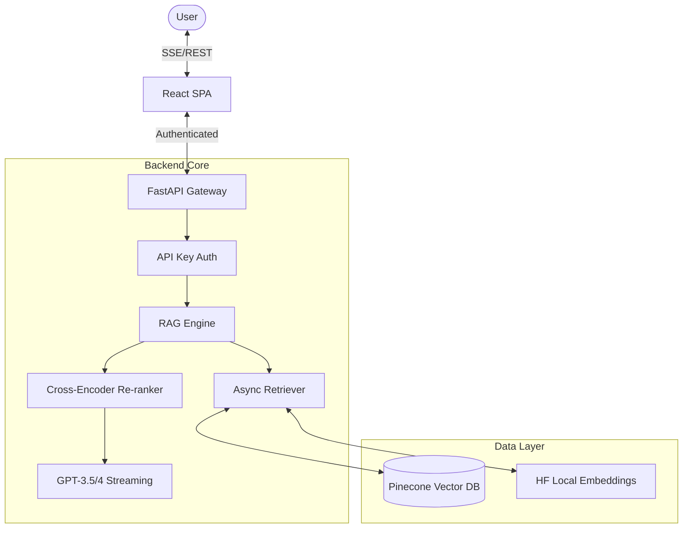

# Enterprise RAG Engine: Production-Grade AI 🚀

[](https://azure.microsoft.com/)
[](https://reactjs.org/)
[](https://fastapi.tiangolo.com/)

A high-performance, secure, and commercially-ready RAG (Retrieval-Augmented Generation) system. This project demonstrates advanced AI engineering patterns utilized by senior software engineers at top-tier tech companies.

## 🏗️ System Architecture

The application is built on a **Modular Clean Architecture**, ensuring deep separation between AI core logic, API delivery, and the user interface.



## 🔥 High-Yield Features

### 1. Real-Time Token Streaming
Provides a "Gemini-style" word-by-word typing effect using Server-Sent Events (SSE), reducing perceived latency to near-zero.

### 2. Multi-Stage Retrieval & Re-ranking
Calculates cosine similarity in Pinecone, followed by **Cross-Encoder re-ranking** to ensure the LLM receives only the most contextually relevant information.

### 3. Enterprise Security
- **Secure Gateway**: All endpoints are protected via `access_token` validation.
- **Strict CORS**: Strict domain-based access control.

### 4. Performance Observability
The UI features a real-time performance dashboard displaying timing breakdowns for:
- 🔍 Retrieval Latency
- 🎯 Re-ranking Precision
- 🧠 LLM Generation Time

## 🚀 One-Click Cloud Deployment (Azure)

This project is optimized for **Azure "Zero-Cost" Deployment**:
- **Backend**: Deploys to *Azure Container Apps* (Consumption Tier - Free).
- **Frontend**: Deploys to *Azure Static Web Apps* (Free Tier).

Detailed instructions are available in the [Deployment Guide](./docs/deployment.md) (or check the repo wiki).

## 🛠️ Local Development

### Prerequisites
- Python 3.10+
- Node.js & npm

### Setup
1. **Env Vars**: Create a `.env` in the root with `OPENAI_API_KEY`, `PINECONE_API_KEY`, and `RAG_API_KEY`.
2. **Backend**:
   ```bash
   pip install -r requirements.txt
   python -m backend.src.main
   ```
3. **Frontend**:
   ```bash
   cd frontend
   npm install
   npm run dev
   ```

---
*Developed with Senior Software Engineering patterns for scalability and reliability.*